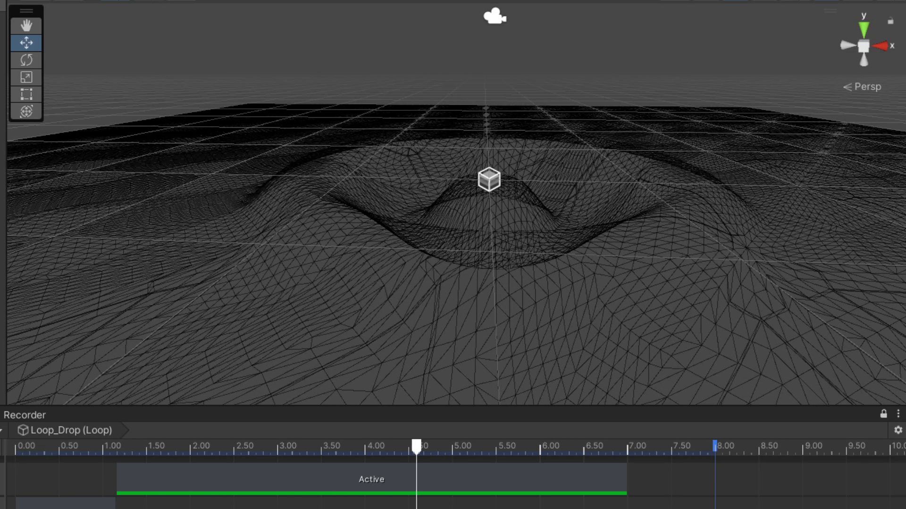

# Water rendering

Experiment with water rendering using Unity.

## Drop collision

Test interacting the water with a falling object. Water is created using vertex displacement, while object interaction occurs through a VFX initiated when object passes through water.

[Shaded recording](https://youtube.com/shorts/pUy50zGLaAU?feature=share)

[Wireframe recording](https://youtu.be/pEPjIgnBRfc)
